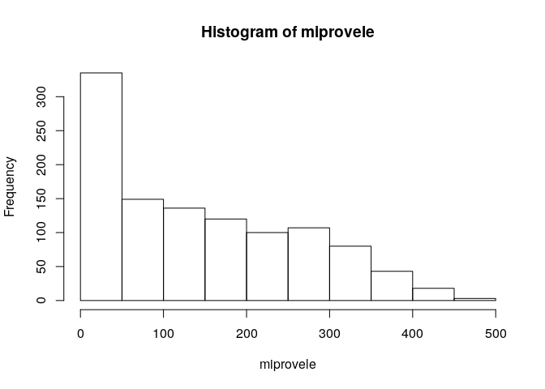

Unidad 1, asignación 2: exportar datos, leer ráster y extraer valores
=====================================================================

Sigo ayudando con `...`. Donde quiera que los veas, deberás sustituirlos por lo que indique el correspondiente mandato.

Dentro de las opciones de `knitr`, en el encabezado de este archivo, es probable que encuentres el argumento `eval = F`. Antes de tejer debes cambiarlo a `eval = T`, para que evalúe los bloques de código según tus cambios.

Provincia asignada
------------------

Toma nota del código de tu provincia asignada aleatoriamente.

``` r
 # abreviatura provaleatoria
 #       acade            11
 #       agrie            09
 #       aleir            10
 #       arqco            16
 #       cindy            12
 #       franc            23
 #       geora            08
 #       hoyod            22
 #       ingan            07
 #       ingdi            19
 #       itac9            15
 #       ivanv            25
 #       lbine            30
 #       leona            24
 #       magda            20
 #       maryj            02
 #       masue            26
 #       mmvol            13
 #       naui2            29
 #       rober            27
 #       wilne            06
 #       yoenn            21
```

Paquetes
--------

-   Carga el paquete `sf` y el paquete `raster`.

``` r
library(sf)
## Linking to GEOS 3.7.1, GDAL 2.4.2, PROJ 5.2.0
library(raster)
## Loading required package: sp
```

Exporta
-------

-   Determina el nombre de la capa provincias con `st_layers` del archivo GeoPackage que se encuentra en la carpeta `data`.

-   Carga la capa de provincias con la función `st_read`, asignándola al objeto `prov`.

-   Genera el objeto `miprov` que sólo contenga tu provincia.

-   Usando la función `st_write`, exporta el objeto `miprov` como GeoPackage a la carpeta `data` con el nombre `miprovexportado.gpkg`.

-   Lee el archivo exportado con la función `st_read` y asígnalo al objeto `miprovexportado`. Dado que sólo tiene una capa, no tienes que especificar el argumento `layer`.

-   Imprime en pantalla el objeto `miprovexportado` (sólo necesitas escribir el nombre del objeto).

``` r
st_layers('data/divisionRD.gpkg')
## Driver: GPKG 
## Available layers:
##   layer_name geometry_type features fields
## 1 divisionRD Multi Polygon       10      4
prov <-st_read(dsn = 'data/divisionRD.gpkg')
## Reading layer `divisionRD' from data source `/home/magda/unidad-1-asignacion-2-rasters-y-exportar-datos-espaciales-magdalenaviloriac/data/divisionRD.gpkg' using driver `GPKG'
## Simple feature collection with 10 features and 4 fields
## geometry type:  MULTIPOLYGON
## dimension:      XY
## bbox:           xmin: 418909.8 ymin: 2100080 xmax: 484340.3 ymax: 2141114
## epsg (SRID):    32619
## proj4string:    +proj=utm +zone=19 +datum=WGS84 +units=m +no_defs
miprov <- prov[prov$PROV %in% '20', ]
st_write(obj = miprov, dsn = 'data/divisionRD.gpkg', driver = 'GPKG')
## Updating layer `divisionRD' to data source `data/divisionRD.gpkg' using driver `GPKG'
## Updating existing layer divisionRD
## Writing 10 features with 4 fields and geometry type Multi Polygon.
miprovexportado <- st_read(dsn = 'data/divisionRD.gpkg')
## Reading layer `divisionRD' from data source `/home/magda/unidad-1-asignacion-2-rasters-y-exportar-datos-espaciales-magdalenaviloriac/data/divisionRD.gpkg' using driver `GPKG'
## Simple feature collection with 20 features and 4 fields
## geometry type:  MULTIPOLYGON
## dimension:      XY
## bbox:           xmin: 418909.8 ymin: 2100080 xmax: 484340.3 ymax: 2141114
## epsg (SRID):    32619
## proj4string:    +proj=utm +zone=19 +datum=WGS84 +units=m +no_defs
miprovexportado
## Simple feature collection with 20 features and 4 fields
## geometry type:  MULTIPOLYGON
## dimension:      XY
## bbox:           xmin: 418909.8 ymin: 2100080 xmax: 484340.3 ymax: 2141114
## epsg (SRID):    32619
## proj4string:    +proj=utm +zone=19 +datum=WGS84 +units=m +no_defs
## First 10 features:
##    PROV REG TOPONIMIA ENLACE                           geom
## 1    20  03    SAMANÁ   0320 MULTIPOLYGON (((470705.9 21...
## 2    20  03    SAMANÁ   0320 MULTIPOLYGON (((470705.9 21...
## 3    20  03    SAMANÁ   0320 MULTIPOLYGON (((470705.9 21...
## 4    20  03    SAMANÁ   0320 MULTIPOLYGON (((470705.9 21...
## 5    20  03    SAMANÁ   0320 MULTIPOLYGON (((470705.9 21...
## 6    20  03    SAMANÁ   0320 MULTIPOLYGON (((470705.9 21...
## 7    20  03    SAMANÁ   0320 MULTIPOLYGON (((470705.9 21...
## 8    20  03    SAMANÁ   0320 MULTIPOLYGON (((470705.9 21...
## 9    20  03    SAMANÁ   0320 MULTIPOLYGON (((470705.9 21...
## 10   20  03    SAMANÁ   0320 MULTIPOLYGON (((470705.9 21...
```

Ráster
------

-   Con la función `raster`, carga el modelo digital de elevaciones que se encuentra en la carpeta `data`. Es el único archivo de extensión `.tif` Asígnalo al objeto `mde`

-   Genera un mapa con la función `plot`, usando la paleta de colores `terrain.colors`.

``` r
mde <- raster('data/mde_rd.tif')
plot(mde, col = terrain.colors(n = 255))
```


Extraer valores del ráster
--------------------------

-   Con la función `raster::extract`, extrae los valores de elevación correspondientes a tu provincia. Utiliza `mde` como objeto ráster y `miprov` como capa zonal. Asigna los valores al objeto `miprovele`.

-   Imprime en pantalla el objeto `miprovele` (sólo necesitas escribir el nombre del objeto).

-   Obtén los estadísticos descriptivos básicos (mínimo, primer cuartil, media, mediana, tercer cuartil, máximo) de `miprovele` con la función `summary`.

-   Genera un histograma de `miprovele` usando la función `hist`.

``` r
miprovele  <- raster::extract(mde, miprov)[[1]]
miprovele
##    [1]  66.580002  48.449276  75.510872  56.840000  86.400002  93.391304
##    [7] 123.652176 108.910004  88.830002 102.651688  68.295456 141.949997
##   [13] 275.420013 151.820007  80.172043 207.899994 271.399994 257.750000
##   [19] 271.829987 335.670013 346.809998 137.721649  11.921569   5.163043
##   [25]   9.702127  11.797873   8.390000   6.880000   8.910000   9.920000
##   [31]  15.363636  14.402061  13.810000   6.540000   6.780000   9.064102
##   [37]   5.958763  19.454546 195.409088 368.910004 307.380005 275.220001
##   [43] 346.779999 320.070007 237.410004  95.156860   9.340909  10.989796
##   [49]  10.520000  18.870001  49.110001  18.309999  36.500000  48.509998
##   [55]  42.849998  64.989998  45.110001  33.360001  10.690000   8.950000
##   [61]  24.870001  20.790001   7.980000  39.659092  39.180000  59.310001
##   [67]  17.207792 297.711121 489.450012 486.890015 247.009995 297.540009
##   [73] 351.040009 326.700012 147.083328   8.819673  14.520000  29.340000
##   [79]  38.029999  42.590000  60.090000  58.240002  76.050003  94.099998
##   [85] 102.970001 112.139999  83.360001  59.529999  40.580002  32.840000
##   [91]  35.290001  21.799999   5.470000  27.530001  70.849998 130.630005
##   [97]  71.419998  13.430000  79.559998  80.615387 200.169998 269.190002
##  [103] 333.940002 293.350006 180.000000 195.660004 196.740005 163.240005
##  [109]  50.500000  25.000000  13.359375  11.653334  11.393939  21.469999
##  [115]  41.820000  76.830002  90.709999  88.279999 105.639999 109.889999
##  [121] 125.610001 150.529999 155.610001 134.550003 139.360001 105.330002
##  [127]  95.209999  72.779999  67.300003  37.639999  13.130000  26.469999
##  [133]  60.040001 103.519997 107.110001  34.009998 112.669998 221.449997
##  [139] 273.630005 188.555557 156.750000 299.179993 321.880005 354.880005
##  [145] 274.010010 206.949997 150.429993 133.779999  72.373497  13.701299
##  [151]  50.810001  85.580002 105.500000  99.540543 150.182922 155.399994
##  [157] 139.160004 137.070007 125.089996 137.990005 121.980003 121.669998
##  [163] 116.269997 126.070000 133.529999 152.149994 171.839996 159.820007
##  [169] 140.809998 163.529999 164.889999 172.990005 176.800003 182.589996
##  [175] 174.490005 166.619995 131.070007 112.629997 112.279999 117.790001
##  [181]  81.930000  48.470001  43.310001 100.610001 115.370003 164.160004
##  [187]  86.529999  90.019997 101.639999 136.229996  39.150002  95.793480
##  [193]  88.185188 161.635132 384.850006 439.209991 372.329987 293.390015
##  [199] 191.479996 133.899994  57.240002   8.590000   6.161290  47.133335
##  [205]  21.980000  12.110000   8.280000  26.740000  53.450001 119.540001
##  [211]  88.448982   6.070000   6.190000   6.123077   6.000000   5.530612
##  [217]   6.776471  12.556701 180.610001 232.190002 223.610001 213.419998
##  [223] 228.020004 238.279999 234.050003 220.710007 220.710007 229.360001
##  [229] 248.679993 258.790009 259.899994 271.480011 271.799988 270.839996
##  [235] 256.500000 248.070007 267.299988 255.750000 236.270004 225.449997
##  [241] 187.179993 160.529999 163.020004 167.020004 163.529999 107.669998
##  [247]  85.839996  87.879997 145.960007 167.869995 188.779999 142.339996
##  [253] 127.610001  95.820000  70.970001  28.299999  18.120001  51.650002
##  [259]  17.190001 178.600006 347.700012 430.750000 421.970001 358.000000
##  [265] 213.259995  78.410004  49.970001  52.060001  44.540001  42.840000
##  [271]  75.300003  61.279999  91.269997  42.630001  30.270000  12.760000
##  [277]  45.470001  87.250000 136.910004  73.272728   4.420000   4.460000
##  [283]   4.270000   4.360000   4.370000  14.340000  35.310001  43.590000
##  [289]  86.629997 218.960007 312.559998 297.720001 291.779999 319.390015
##  [295] 334.890015 339.149994 335.910004 314.410004 318.700012 327.230011
##  [301] 330.589996 340.489990 348.489990 342.450012 375.109985 344.809998
##  [307] 326.559998 319.799988 314.940002 309.679993 314.399994 290.450012
##  [313] 237.770004 243.029999 244.039993 225.320007 204.039993 172.160004
##  [319] 197.929993 191.119995 263.850006 279.399994 266.279999 276.950012
##  [325] 261.350006 194.220001 185.059998  84.959999  31.950001  11.450000
##  [331]  63.840000 147.690002 256.049988 365.679993 269.959991 208.449997
##  [337] 116.739998  62.509998  84.730003  90.839996 105.809998 102.709999
##  [343]  87.129997  90.059998  90.980003  57.389999  25.360001  37.619999
##  [349]  83.800003 130.500000 123.326317   3.970000   4.070000   5.690000
##  [355]   8.500000  16.459999  17.719999  55.860001 128.309998 223.369995
##  [361] 348.700012 379.089996 397.820007 414.059998 425.630005 420.609985
##  [367] 417.279999 416.959991 389.450012 389.739990 382.339996 384.350006
##  [373] 393.010010 375.839996 363.059998 380.369995 383.179993 344.980011
##  [379] 318.299988 336.179993 350.720001 325.769989 295.769989 285.970001
##  [385] 293.820007 258.750000 226.580002 228.699997 201.190002 256.869995
##  [391] 301.410004 355.160004 386.179993 275.250000 307.399994 327.250000
##  [397] 290.230011 263.850006 198.910004  90.150002  52.630001 141.639999
##  [403] 236.860001 170.449997 295.170013 281.579987 176.580002 133.160004
##  [409]  97.809998 101.779999  98.330002 102.360001 107.660004 116.669998
##  [415] 101.129997  76.339996  49.860001  77.419998  99.330002 147.529999
##  [421] 116.699997   5.960000   6.130000   9.330000  19.020000  25.219999
##  [427]  38.889999  46.230000 136.110001 206.449997 222.929993 235.580002
##  [433] 304.660004 342.109985 373.170013 403.200012 437.570007 418.470001
##  [439] 406.500000 362.470001 370.609985 374.269989 388.799988 424.679993
##  [445] 448.589996 455.760010 444.829987 405.739990 326.119995 326.179993
##  [451] 304.989990 284.130005 255.940002 223.360001 216.089996 225.149994
##  [457] 244.779999 237.889999 263.670013 319.130005 316.579987 377.130005
##  [463] 336.739990 333.420013 291.779999 315.019989 268.470001 257.500000
##  [469] 204.830002  85.250000  70.470001 130.809998  99.000000 181.619995
##  [475] 305.549988 252.259995 234.929993 273.160004 146.729996 103.730003
##  [481]  74.370003  83.919998  94.970001  68.430000  74.110001  60.750000
##  [487] 103.839996 111.000000  50.222221   5.480000   6.190000   8.610000
##  [493]  11.680000  17.670000  20.790001  26.020000  33.860001  51.500000
##  [499]  75.489998 103.139999 113.940002 114.080002 138.330002 176.460007
##  [505] 299.989990 354.260010 377.500000 371.119995 400.940002 426.109985
##  [511] 392.489990 367.940002 357.799988 373.929993 386.089996 395.320007
##  [517] 321.279999 315.260010 298.750000 276.079987 237.119995 228.139999
##  [523] 229.979996 233.979996 238.279999 228.750000 232.460007 275.609985
##  [529] 325.500000 352.619995 320.670013 298.179993 307.220001 343.829987
##  [535] 274.720001 265.769989 206.050003 107.419998  64.010002  57.169998
##  [541]  78.610001  64.419998 144.000000 224.839996 252.880005 306.220001
##  [547] 197.789993 152.850006  70.389999 105.639999 113.750000  56.110001
##  [553]  75.089996  68.480003  58.130001   6.840000   6.030000   5.700000
##  [559]   9.930000  12.700000  16.280001  17.990000  17.139999  17.180000
##  [565]  21.379999  29.309999  35.470001  34.049999  51.110001  84.059998
##  [571] 140.330002 227.470001 291.839996 278.700012 326.660004 363.429993
##  [577] 378.649994 366.299988 376.070007 337.579987 293.429993 245.449997
##  [583] 195.529999 259.609985 274.670013 275.589996 246.710007 246.839996
##  [589] 264.239990 285.459991 288.260010 280.470001 292.359985 301.549988
##  [595] 309.709991 362.799988 339.910004 324.510010 325.640015 340.540009
##  [601] 312.880005 273.859985 209.600006 147.490005  70.779999  51.020000
##  [607] 112.550003 134.089996 106.949997 165.309998 196.339996 250.440002
##  [613] 213.369995 215.300003 186.610001 178.509995  88.199997  48.680000
##  [619]  39.180000  39.240002  19.771429   5.650000   5.020000   4.900000
##  [625]   4.520000   3.910000   3.570000   3.650000   3.670000   3.870000
##  [631]   5.750000   7.360000  11.030000  15.140000  16.219999  24.770000
##  [637]  22.670000  33.290001  57.709999  78.940002 104.459999 104.519997
##  [643] 141.919998 215.309998 206.240005 197.050003 199.300003 174.729996
##  [649] 169.470001 210.630005 250.169998 283.750000 289.500000 269.959991
##  [655] 298.910004 315.510010 299.589996 302.220001 324.420013 331.630005
##  [661] 325.720001 338.160004 311.589996 272.820007 248.199997 261.559998
##  [667] 248.000000 213.770004 213.279999 172.350006  72.300003 110.459999
##  [673] 100.410004 191.600006 227.910004 220.770004 250.979996 268.350006
##  [679] 277.809998 254.529999 213.889999 165.490005  74.790001  36.709999
##  [685]  20.840000   3.630000   2.920000   3.690000   4.790000   3.590000
##  [691]   3.920000   4.160000   7.340000   9.750000   6.864198  23.989361
##  [697]  30.730000  29.750000  21.080000  25.090000  29.559999  32.009998
##  [703]  38.799999  40.919998  59.630001  71.809998 108.260002 178.839996
##  [709] 186.570007 163.500000 262.690002 312.799988 274.720001 300.600006
##  [715] 290.209991 254.789993 276.279999 262.019989 274.660004 249.160004
##  [721] 213.960007 190.649994 166.389999 143.259995 118.239998 115.540001
##  [727]  79.110001 138.279999 126.860001 169.300003 196.750000 206.050003
##  [733] 261.799988 298.480011 290.630005 258.679993 262.059998 199.309998
##  [739] 120.199997  75.820000  14.217391   3.540000   4.420000   6.230000
##  [745]   8.390000  12.580000   7.900000   8.135135   9.181818  18.400000
##  [751]  13.815217  13.223684  14.411111  19.155844  16.459999  23.297873
##  [757]  19.635416  24.910000  34.290001  51.209999 121.110001 157.440002
##  [763] 192.880005 207.679993 189.059998 136.899994 219.509995 200.089996
##  [769] 198.960007 172.699997 168.399994 184.669998 147.399994 108.099998
##  [775]  93.699997  86.900002  78.230003 134.639999 147.240005 175.279999
##  [781] 226.580002 231.339996 315.589996 341.390015 304.730011 315.899994
##  [787] 295.910004 226.990005 107.449997  55.779999   5.560000   6.930000
##  [793]   8.140000  11.350000   9.350000  10.512500  18.538462  25.128204
##  [799]  32.049999  57.410000 105.500000 137.149994  92.760002 151.580002
##  [805] 113.199997 114.220001 171.779999 158.619995 150.050003 151.639999
##  [811] 116.489998  51.880001  47.049999  52.970001  99.989998  88.989998
##  [817] 109.150002 200.259995 231.710007 268.170013 319.500000 336.190002
##  [823] 321.950012 304.350006 206.059998 130.110001  60.650002   3.660000
##  [829]   6.400000  12.430000  10.310000  10.575342  31.646465  28.730000
##  [835]  45.980000  42.570000  42.720001  74.102043  66.870003  83.404259
##  [841]  88.763443  68.250000  62.610001  40.849461  46.235294  51.808083
##  [847]  22.051546  66.660004 123.489998 187.460007 242.589996 279.970001
##  [853] 273.230011 277.739990 302.329987 171.380005  40.642857   2.840000
##  [859]   4.050000   8.640000  13.610000   6.660000   8.814285  11.690476
##  [865]   9.582278   6.437500  72.913979 136.850006 161.839996 145.199997
##  [871] 154.800003 195.500000 153.020004  54.986301   2.680000   3.890000
##  [877]   6.580000  11.090000   6.140000   9.857142  33.181820  34.774647
##  [883]  56.166668  67.535713  65.872337  52.765957   3.790000   4.640000
##  [889]   9.050000   7.020000   5.950000   3.940000   4.490000  11.160000
##  [895]  12.010000   7.020000   6.730000   4.150000   2.670000   2.700000
##  [901]   3.980000  10.470000  14.120000   7.330000   7.793103   7.920000
##  [907]   8.020000   5.520000   3.140000   3.280000   3.220000   3.270000
##  [913]  12.030000  13.330000   8.760000   8.044776   4.550000   5.960000
##  [919]   5.560000   3.960000   3.230000   2.380000   2.930000   4.510000
##  [925]  12.800000   8.610000   6.470000   4.730000   5.270000   4.700000
##  [931]   3.100000   2.500000   2.940000   3.820000   4.580000   5.480000
##  [937]  10.790000   5.780000   5.505051   3.770000   2.800000   2.730000
##  [943]   3.280000   4.600000   4.280000   5.590000   8.800000   7.400000
##  [949]  13.470000   5.790000   4.290000   3.690000   3.110000   4.020000
##  [955]   3.720000   6.210000  14.270000  15.570000  13.270000  14.530000
##  [961]  13.630000   5.580000   5.930000   5.240000   6.170000   5.970000
##  [967]  10.230000  10.650000  12.840000  11.860000   8.470000   5.454545
##  [973]   7.760000   7.620000  10.300000   7.930000   8.480000  10.800000
##  [979]  14.870000  33.169998  38.090000  12.700000   3.964286  64.709999
##  [985]  67.269997  65.519997  57.599998  71.010002  71.639999  64.190002
##  [991]  78.610001  60.869999  57.970001  40.040001 140.070007 135.270004
##  [997] 123.820000 126.879997  92.160004  90.680000  91.809998 101.910004
## [1003]  74.540001  31.636364 154.990005 142.289993 147.339996 141.820007
## [1009] 133.130005 120.800003 113.139999 121.930000  87.769997  51.187500
## [1015]  49.779221  58.950001 168.410004 167.350006 165.380005 131.240005
## [1021] 105.290001 119.730003 138.690002 139.759995 118.769997 108.669998
## [1027] 133.029999 179.729996 170.220001 168.169998 154.820007 125.830002
## [1033] 127.410004 140.770004 143.330002 145.970001 139.800003 143.429993
## [1039] 188.690002 184.750000 168.699997 156.179993 163.470001 165.190002
## [1045] 169.300003 156.309998 171.389999 174.630005 172.710007 194.029999
## [1051] 195.000000 172.880005 167.979996 175.339996 178.429993 193.110001
## [1057] 190.929993 181.690002 175.130005 204.410004 191.490005 187.940002
## [1063] 188.110001 192.309998 202.110001 207.419998 209.699997 202.160004
## [1069] 223.720001 207.720001 194.770004 209.729996 218.850006 214.990005
## [1075] 220.149994 218.149994 224.240005 233.139999 245.970001 235.270004
## [1081] 232.339996 247.570007 233.320007 259.660004 266.709991 258.730011
## [1087] 276.959991 289.100006 276.170013 298.970001 295.459991
summary(miprovele)
##    Min. 1st Qu.  Median    Mean 3rd Qu.    Max. 
##    2.38   30.50  120.80  143.94  236.56  489.45
hist(miprovele)
```


